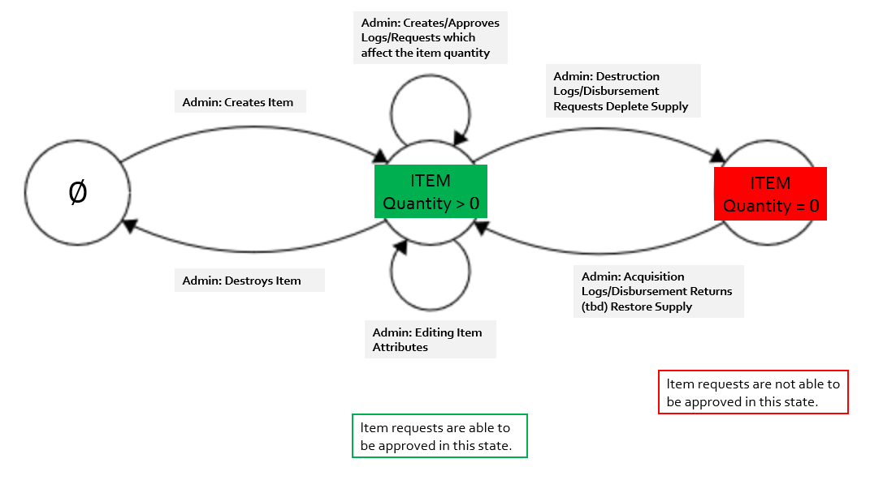
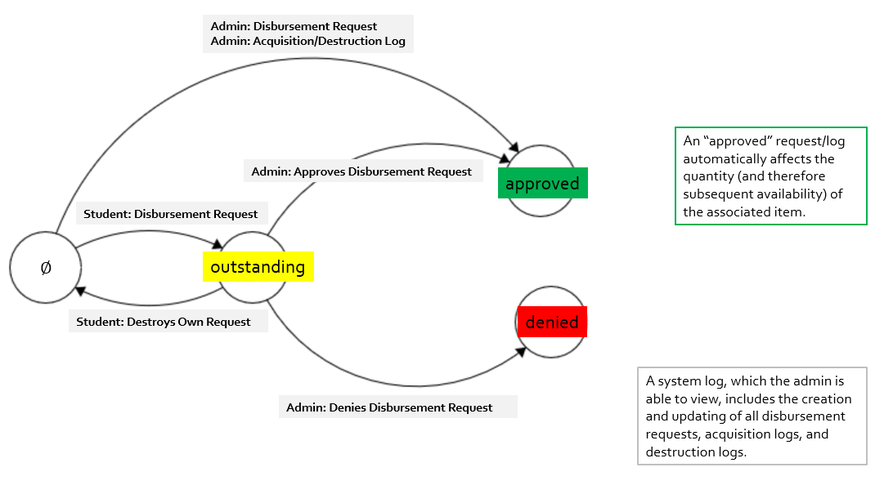

# Development Guide

3.1. Developer guide: A document shall be provided which orients a new developer to how your system is constructed at a high level, what technologies are in use, how to configure a development/build environment, and how the database schema (or equivalent) is laid out.

Our software system, Spicy Software, is a web application built using the Ruby on Rails framework.

One key feature of the Ruby on Rails stack is that it favors convention over configuration, meaning that it provides users with default structures for a database and the web pages themselves. More specifically, Ruby on Rails operates under the Model-View-Controller (MVC) framework.

The ECE Inventory system is composed of several interacting model classes: these classes include the User, Item, Request, Tag, Log, Item-Tag, and Account Request classes.

The user, item, request, and tag models are directly mentioned in the handout, but the account request and log classes are two additional model classes created to satisfy the requirements. Account Requests allow the admin to approve users before they begin using the inventory app; logs track every transaction that ever takes place (including updates to the request statuses and disembursements that require no request from a user).

The database used by Spicy Software Inc. is PostSQL, but in this project, database operations are performed by ActiveRecord, which provides default database operations without having the user to interact with the database directly.

The database consists of tables with the model classes as the primary (lookup) key. The fields of these tables include all the fields of the model classes. Table 1 below displays each model class along with its attributes, such that there is a table for each model class. For instance, the fields of the item class include the unique name, model number, quantity, location, and the description of the item. 

| Model Class |                                                       Fields                                                       |
|-------------|:------------------------------------------------------------------------------------------------------------------:|
| User        | username, created_at, updated_at, password_digest, email, email_confirmed, confirm_token, status, privilege |
| Item        | unique_name, quantity, model_number, description, location                                                         |
| Request     | datetime, user_id, quantity, reason, instances, created_at, updated_at, status, request_type, item_id, response     |
| Tag         | name, created_at, updated_at                                                                                       |
| Item_Tags   | tag_id, item_id, created_at, updated_at                                                                            |
| Logs        | quantity, created_at, updated_at, request_type, item_id, user_id                                          |

In many cases, a table contains a field that is already a model class. For instance, the Request table contains the fields item_id and user_id. In these cases, a foreign key relation is established to speed-up the lookup of an item in the request table.  

Below we will briefly describe the use of each case in our project and describe their fields.

### User
Users keep track of all users in the system. Each user specifies their own username, password, and email. Both username and email must be unique among all the users. The fields created_at and updated_at are automatically updated at time of creation/user-settings-editting. The email_confirmed and confirm_token fields are used during account creation - the confirm_token string is emailed to a user, and a user is able to use it to confirm their email-account link; after this occurs, email_confirmed (a boolean) is set to TRUE. During this time, the status field will be set to one of its two enum values, "waiting"; after an admin logs in and approves the account, this will be changed to "approved", and the user will be able to proceed with typical operations in the system, such as viewing and requesting items. Finally, the privilege (also consisting of enums, "student", "ta", and "admin") of a user can be edited only by an admin, and determines the extent to which a user can maneuver in the environment. Currently, both "student" and "ta" have the same capabilities in viewing items, requesting items disbursements for themselves, and canceling requests. An admin is able to approve users, request disbursements for all users, log acquisitions, log destructions, approve outstanding requests (as long as the item quantity allows), create items, update items, create tags and associate them with items, etc.

Users has-many requests.

### Item
An individual item instance includes many of the fields specified in our project assignment: a name, a quantity, a model, a description, and a location. An admin can edit these at any time, although the preferred method for updating method is through logging rather than direct editing. Item quantities are automatically updated when an approved request/log goes through. Below is a diagram showing how an item instance in our system. 

Items are linked to tags through a mutual has-many-through association, through the Item_Tag class, which allows many items to be linked to many tags and vice versa. In addition, items has-many requests and has-many logs.

### Tag
Tags are used solely for the purpose of specifying certain properties of items that may apply to multiple items. For this reason, they consist purely of a name field (specified by the admin at time of creation) and the created_at and updated_at fields which are automatically filled in at the time. 

Tags are associated with items through a mutual has-many-through association, through the Item_Tag class. This allows users to search items based on tags.

### Item_Tags
Item_Tags exists to allow the mutual has-many-through association between Tag and Item. 

### Request
Users can create requests, and specify the item requested, the quantity, and reason (required). The created_at and updated_at fields are automatically populated at the time. Requests are strictly for disbursements for student users, but can be used for acquisition and destruction as well for admin, although admins can also use logging for that purpose; these are the possible enums for the request_type field. The status field is also made up of enums; admin-created requests (can be for themselves or for other uses) are automatically "approved", whereas student-created requests are automatically "outstanding"; admin can then go in and "approve" or "deny" requests, and include a reply in the response field. Below is a dataflow that illustrates this process. 

Requests are belong-to both items and users; in addition, they include the unique item_id and user_id fields in order for these associations to be easily searched. Finally, logs and requests creation and updating are automatically displayed to the admin in a log GUI. 

### Logs
Only admin can create logs. At the time, created_at and updated_at are filled in automatically. Admin specify the item, the quantity, and the request_type, which can be "disbursement", "acquisition", and "destruction". As mentioned above, logs and requests creation and updating are automatically displayed to the admin in a log GUI. 

Logs belong-to items and users.
 
## Deployment

Please refer to the our [deployment guide](DeploymentGuide.md). 
